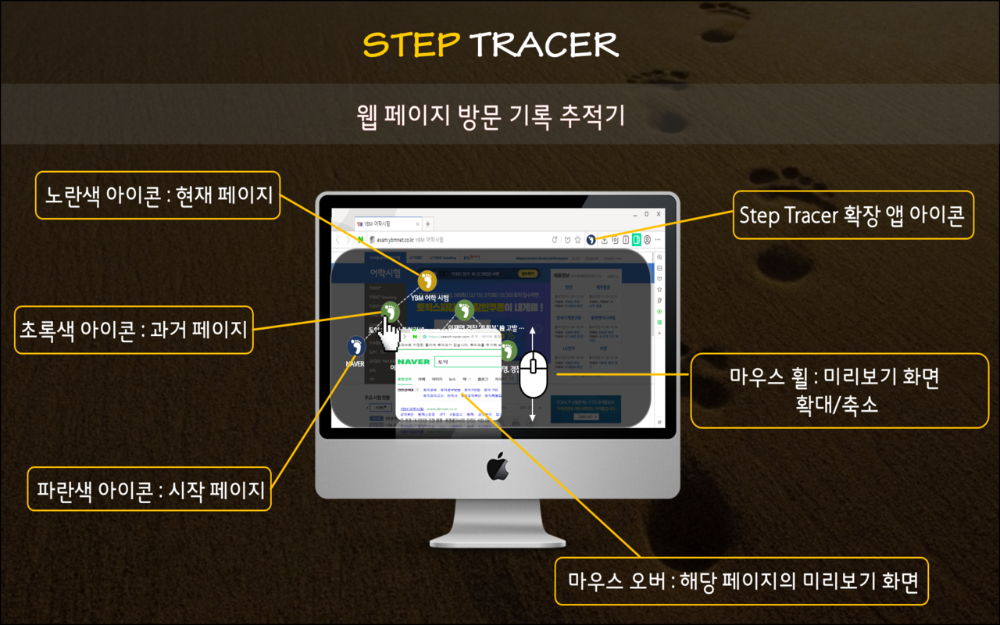

# Step Tracer
> 웹 페이지의 방문기록을 트리 모양으로 시각화 해주는 Whale Extension 입니다.

 

기억하기 힘든 복잡한 방문기록, [Step Tracer](https://store.whale.naver.com/detail/ldjkadggpjmffcdpcdeanhmmkifbekad)로 빠르게 접근하여 보다 편하게 웹 서핑을 즐겨보세요!

## 설치 방법

[사용자 모드]
1. [웨일 브라우저](https://whale.naver.com) 다운로드 및 설치
2. [Step Tracer](https://store.whale.naver.com/detail/ldjkadggpjmffcdpcdeanhmmkifbekad) 페이지 들어가서 '웨일에 추가하기' 클릭

[개발자 모드]

```
$ git clone https://github.com/meh9184/step-tracer
$ cd step-tracer
$ npm install
$ npm run build
```

[웨일 개발자 센터](https://developers.whale.naver.com/tutorials/debugging/)에서 안내하는 대로, clone한 `확장앱 소스폴더`를 로드


## 주요 기능
- Step Tracer 버튼 클릭 / Ctrl+Q : 웹 페이지 방문기록을 Tree 모양으로 시각화
- 노드 클릭 : 해당 페이지로 이동
- 노드에 마우스 오버 : 미리보기 화면 제공
- 노드에 마우스 오버한 상태로 휠 스크롤 : 미리보기 화면 확대 / 축소
- url 링크에 마우스 우클릭 ->  ‘Step Tracer에 추가’ 클릭 : 새로운 노드 추가


## 사용 방법

[단축키]
- Windows
  - Ctrl+Q : 방문기록 트리 올림 / 내림
  - ESC : 방문기록 트리 내림
- Mac
  - Command+Shift+Y : 방문기록 트리 올림 / 내림
  - ESC : 방문기록 트리 내림  


[아이콘 색깔]
- 파란색 : 시작 페이지
- 초록색 : 과거 페이지
- 노란색 : 현재 페이지  


[이렇게 사용해보세요]
- 방문트리 단축키 Ctrl+Q 를, 탭 이동 단축키 Ctrl+Tab 과 병행하여 사용하면 편리합니다.  


[이럴 때 사용해보세요]
- 토익 시험 접수를 위해 네이버에 ‘토익’을 검색했는데, 자극적인 인기검색가 보일 때  
  -> 맘 편히 서핑한 후 방문기록 트리를 열어(Ctrl+Q) ‘토익 검색 결과’ 페이지로 다시 컴백
  
- 네이버 스포츠 뉴스를 보다가 갑자기 과거에 방문했던 쇼핑몰 페이지를 찾아가고 싶을 때  
  -> 방문기록 트리를 열어(Ctrl+Q) 미리보기 화면으로 해당 페이지를 찾아 이동
  
- 유튜브 영상을 보던 중 매력적인 추천 영상들이 여러 개 있을 때  
  -> 각 영상 링크 url 마다 마우스 우클릭 -> ‘Step Tracer에 추가’ 하여 현재 페이지의 후속 노드로 기록  


## 주의 사항
- 웨일 새 탭 페이지(whale://newtab) 에서는 방문트리를 띄울 수 없습니다.
- 단축키 Ctrl+Shift+Q 는 브라우저 종료 키입니다. 방문트리 단축키 Ctrl+Q를 사용할 때 조심해 주세요.
- 방문트리의 생명주기는 탭의 생성부터 종료까지입니다. 탭을 한번 종료하면 다시 불러올 수 없으니 유의해주세요.
- 네트워크 상태에 따라 미리보기 화면 캡처 타이밍이 늦어질 수 있습니다.
- 아직 방문하지 않은 페이지의 미리보기 화면은 default 이미지로 대체됩니다.


## 개발 진행중인 추가 기능
- 노드 아이콘 이미지/제목 편집 기능
- 노드 삭제/추가 기능
- 방문트리 저장 및 공유 기능
- 탭 합병 기능


## 업데이트 내역

* 1.0.0 (2018.12.10)
    * 확장앱 배포  
    
* 1.1.0 (2018.12.26)
    * 수정: 방문트리의 새 탭 아이콘 생성되지 않도록 수정 
    * 추가: 방문트리 띄울 수 없는 페이지에서 팝업 알림

## 정보

[Eunhwan Moon](https://github.com/meh9184) – meh9184@naver.com


## 기여 방법

1. <https://github.com/meh9184/step-tracer/fork>을 포크합니다.
2. `git checkout -b feature/fooBar` 명령어로 새 브랜치를 만드세요.
3. `git commit -am 'Add some fooBar'` 명령어로 커밋하세요.
4. `git push origin feature/fooBar` 명령어로 브랜치에 푸시하세요. 
5. 풀리퀘스트를 보내주세요.

<!-- Markdown link & img dfn's -->
[npm-image]: https://img.shields.io/npm/v/datadog-metrics.svg?style=flat-square
[npm-url]: https://npmjs.org/package/datadog-metrics
[npm-downloads]: https://img.shields.io/npm/dm/datadog-metrics.svg?style=flat-square
[travis-image]: https://img.shields.io/travis/dbader/node-datadog-metrics/master.svg?style=flat-square
[travis-url]: https://travis-ci.org/dbader/node-datadog-metrics
[wiki]: https://github.com/yourname/yourproject/wiki
